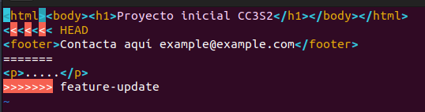

## **Actividad: Explorando diferentes formas de fusionar en Git**

### **Objetivo de aprendizaje:**  

En esta actividad, exploraremos el proceso de fusionar dos ramas en Git utilizando tres métodos diferentes: fast-forward, no-fast-forward y squash. A través de los ejemplos, comprenderás cómo funcionan y cuándo es recomendable utilizar cada tipo de fusión.

#### Contexto

En el mundo del desarrollo de software, Git se ha consolidado como una herramienta esencial para la gestión de versiones, permitiendo a equipos y desarrolladores individuales llevar un control preciso de los cambios en el código fuente.

Dentro de Git, las fusiones juegan un rol fundamental al combinar el trabajo de diferentes ramas, integrando características, correcciones y mejoras al código base. 

Sin embargo, no todas las fusiones son iguales, y las estrategias disponibles en Git ofrecen distintos beneficios según el contexto de desarrollo. Esta actividad explora tres estrategias de fusión: **Fast-forward**, **No-fast-forward**, y **Squash**, cada una adaptada a situaciones específicas, desde desarrollos individuales hasta metodologías ágiles, CI/CD y DevOps.

##### 1. Fast-forward: Mantener un historial limpio y lineal

La fusión fast-forward en Git es la opción predeterminada y más simple cuando no se han realizado commits en la rama principal (o base) desde que se creó la rama de característica. En lugar de crear un nuevo commit de fusión, este método simplemente mueve el puntero HEAD de la rama principal al último commit de la rama de característica. Como resultado, el historial de commits permanece lineal y sin interrupciones.

El fast-forward es ideal en desarrollos individuales o proyectos pequeños, donde el flujo de trabajo es secuencial y no se realizan múltiples contribuciones paralelas. Al evitar commits de fusión innecesarios, este enfoque mantiene el historial del proyecto limpio y fácil de seguir. Para desarrolladores que trabajan solos, la fusión fast-forward es perfecta, ya que no agrega complejidad innecesaria ni desordena el historial.

Sin embargo, esta simplicidad puede convertirse en un obstáculo en proyectos colaborativos más grandes. Al no registrar explícitamente el punto de fusión entre ramas, la capacidad de entender el contexto de la integración de características se pierde. A largo plazo, en un equipo, puede ser difícil rastrear cuándo y cómo se fusionaron diferentes ramas, lo que convierte al fast-forward en una estrategia menos adecuada para proyectos con múltiples colaboradores o donde los cambios ocurren simultáneamente en varias ramas.

##### 2. No-fast-forward: Preservar el contexto de los cambios

A diferencia de la fusión fast-forward, la opción no-fast-forward crea un commit de fusión que preserva explícitamente el momento y el contexto en el que se integraron las ramas. Esta estrategia es fundamental en entornos de trabajo colaborativo, especialmente en proyectos grandes donde múltiples desarrolladores están trabajando simultáneamente en diferentes características o correcciones.

El commit de fusión que se genera en una fusión no-fast-forward tiene dos "parent commits": uno correspondiente a la rama de origen y otro a la rama destino. Este enfoque proporciona una clara trazabilidad de los cambios y facilita la revisión del historial, lo que es crucial en equipos donde es necesario entender no solo qué cambios se hicieron, sino también cuándo y por qué se unieron a la rama principal.

Para equipos grandes, la estrategia no-fast-forward es esencial, ya que permite la preservación de un registro claro de las fusiones. Es particularmente útil en proyectos donde la colaboración es constante y donde diferentes ramas de trabajo pueden tener una vida más larga. Este enfoque asegura que los desarrolladores puedan revisar el contexto de una fusión en cualquier momento, ofreciendo transparencia en el proceso de desarrollo.

No obstante, el uso excesivo de commits de fusión puede desordenar el historial, dificultando su lectura. Por lo tanto, es importante que los equipos balanceen el uso de no-fast-forward con la necesidad de mantener un historial manejable, reservándolo para fusiones clave que involucren integraciones importantes.

##### 3. Squash: Condensar cambios para una rama principal limpia

La opción squash ofrece una estrategia diferente, orientada a mantener la limpieza del historial al integrar ramas de características. Esta técnica toma todos los commits de la rama de origen y los aplasta en un solo commit antes de fusionarlos con la rama principal. El resultado es un historial limpio y condensado, ideal para proyectos donde se prioriza la simplicidad y claridad en el código base.

El uso de fusiones squash es común en metodologías ágiles, CI/CD y entornos DevOps, donde se busca integrar frecuentemente características en ciclos cortos de desarrollo. Los equipos que adoptan estas metodologías tienden a realizar pruebas, refactorizaciones y cambios iterativos dentro de sus ramas de trabajo. A través del squash, todos estos pequeños commits experimentales y de prueba se combinan en uno solo, eliminando ruido en el historial y haciendo que la rama principal se mantenga limpia y enfocada solo en los cambios finales e importantes.

Sin embargo, el uso de squash tiene una desventaja significativa: al aplastar los commits, se pierde el historial detallado de los cambios individuales realizados en la rama de característica. Esto puede ser un problema si se necesita entender el proceso de desarrollo de esa característica o si los commits individuales tienen valor informativo. Aunque simplifica el historial, el squash sacrifica la trazabilidad de los pasos intermedios.

Además, el squash puede generar dilemas éticos en equipos colaborativos, ya que el autor del commit consolidado puede ser diferente de quienes realizaron los commits originales. En proyectos donde es importante mantener la atribución de autoría o el contexto completo de los cambios, el squash debe usarse con prudencia. Es crucial encontrar un balance entre mantener la limpieza del historial y respetar la integridad de los commits individuales de los colaboradores.

Cada una de estas estrategias de fusión tiene su lugar dentro del flujo de trabajo de Git, dependiendo del contexto del proyecto y los objetivos del equipo. El fast-forward es ideal para mantener un historial limpio en proyectos individuales o sencillos, mientras que el no-fast-forward proporciona un valioso contexto en equipos grandes donde la transparencia en las fusiones es crucial. Finalmente, el squash es una herramienta poderosa para proyectos ágiles y de DevOps, donde la limpieza del historial es una prioridad, aunque conlleva ciertos riesgos en la preservación del historial detallado.

Elegir la estrategia de fusión adecuada es una decisión crítica para mantener un flujo de trabajo eficiente y un historial de Git claro y manejable, particularmente en equipos colaborativos. Comprender cuándo y cómo usar cada tipo de fusión permitirá a los desarrolladores optimizar sus prácticas de integración y asegurar que el desarrollo continúe de manera fluida y organizada.
#### Ejercicios

1. **Clona un repositorio Git con múltiples ramas.**  
   Identifica dos ramas que puedas fusionar utilizando `git merge --ff`.  
   Haz el proceso de fusión utilizando `git merge --ff`.  
   Verifica el historial con `git log --graph --oneline`.  

Como no podemos clonar algún repositorio remoto de múltiples ramas que tengamos haremos uno nosotros de forma local. En este creamos un archivo `README.md` que inicializará el historial de estos cambios, luego crearemos una nueva rama llamada `feature` donde haremos ciertos cambios a el mismo archivo. 


Nos cambiamos a la rama main y ejecutamos el comando `git merge --ff`, si encontrásemos algún conflicto se tendrá que resolver manualmente, ahora cuando se halla realizado la combinación podremos ver nuestro historial de forma gráfica como `git log --graph --oneline`.


   **Pregunta:** ¿En qué situaciones recomendarías evitar el uso de `git merge --ff`? Reflexiona sobre las desventajas de este método.

Cuando deseamos mantener el historial de los cambios realizados en otras ramas, especialmente cuando estas llevan largos historiales y contengan características importantes. Si bien la linealidad puede ser muy buena para una mejor legibilidad, puede que los commits de cambios de una característica se mezclen con los de otros y se pierda el flujo de trabajo.

2. **Simula un flujo de trabajo de equipo.**  
   Trabaja en dos ramas independientes, creando diferentes cambios en cada una.  
   Fusiona ambas ramas con `git merge --no-ff` para ver cómo se crean los commits de fusión.  
   Observa el historial utilizando `git log --graph --oneline`.  

	Para este ejercicio contaremos con un repositorio de dos ramas independientes que contengan diferentes commits en cada una.


Basado en la construcción de dichas ramas, supongamos que deseamos combinar nuestros commits en nuestra rama prinicipal. Dentro de la rama main ejecutamos `git merge --no-ff feature`


Cuando se ejecute se nos pedirá insertar un mensaje para el commit merge.


Finalmente ejecutamos `git log --graph --oneline --all` podremos visualizar la estructura de dicho merge.


   **Pregunta:** ¿Cuáles son las principales ventajas de utilizar `git merge --no-ff` en un proyecto en equipo? ¿Qué problemas podrían surgir al depender excesivamente de commits de fusión?

Entre las principales ventajas se pueden destacar la de la creación de commits merge que permitan una mejor interpretación y legibilidad del historial de commits de su respectivo repositorio sin combinar ramas; además, permite un rollback mejor entedido gracias a dichos commits merge.

Sin embargo, un historial de commits completamente repleto de estos commits merge pueden resultar ser contra productivos y entorpecer los rebases que se deseen realizar e incluso interferir con los pipelines CI/CD.

3. **Crea múltiples commits en una rama.**  
   Haz varios cambios y commits en una rama feature.  
   Fusiona la rama con `git merge --squash` para aplanar todos los commits en uno solo.  
   Verifica el historial de commits antes y después de la fusión para ver la diferencia.  

Crearemos un repositorio local donde crearemos un archivo `README.md` con el que iniciaremos el historial de cambios agregando dos líneas de texto.


Creamos una nueva rama llamada feature en la que realizaremos distintos cambios como añadir 2 nuevos archivos llamados archivo1.txt y archivo2.txt; además, commiteamos dichos nuevos cambios y verificamos el historial de forma gráfica.


Ahora regresamos a nuestra rama main y ejecutamos el comando de `git merge --squash feature` con lo que mezclaremos nuestras ramas; por último, podemos ver gráficamente nuestro historial mediante `git log --graph --oneline --all`


   **Pregunta:** ¿Cuándo es recomendable utilizar una fusión squash? ¿Qué ventajas ofrece para proyectos grandes en comparación con fusiones estándar?

El rebase es ideal para commits independientes (como cuando crean archivos nuevos sin afectarse entre sí) y para refinar el historial una vez finalizada una funcionalidad. Esta práctica ofrece un registro más ordenado, mejor trazabilidad de características y facilita significativamente las revisiones de código.

4. **Resolver conflictos en una fusión non-fast-forward**

En algunos casos, las fusiones no son tan sencillas y pueden surgir conflictos que necesitas resolver manualmente. Este ejercicio te guiará a través del proceso de manejo de conflictos.

1. Inicializa un nuevo repositorio:
   ```bash
   mkdir prueba-merge-conflict
   cd prueba-merge-conflict
   git init
   ```


2. Crea un archivo index.html y realiza un commit en la rama main:
   ```bash
   echo "<html><body><h1>Proyecto inicial CC3S2</h1></body></html>" > index.html
   git add index.html
   git commit -m "commit inicial del  index.html en main"
   ```


3. Crea y cambia a una nueva rama feature-update:
   ```bash
   git checkout -b feature-update
   ```


4. Edita el archivo y realiza un commit en la rama feature-update:
   ```bash
   echo "<p>.....</p>" >> index.html
   git add index.html
   git commit -m "Actualiza ..."
   ```


5. Regresa a la rama main y realiza una edición en el mismo archivo:
   ```bash
   git checkout main
   echo "<footer>Contacta aquí example@example.com</footer>" >> index.html
   git add index.html
   git commit -m "....index.html"
   ```


6. Fusiona la rama feature-update con --no-ff y observa el conflicto:
   ```bash
   git merge --no-ff feature-update
   ```


7. Git detectará un conflicto en index.html. Abre el archivo y resuelve el conflicto. Elimina las líneas de conflicto generadas por Git (`<<<<<<<`, `=======`, `>>>>>>>`) y crea la versión final del archivo con ambos cambios:

   ```html
   <html>
     <body>
       <h1>....</h1>
       <p>....</p>
       <footer>...example@example.com</footer>
     </body>
   </html>
   ```



8. Agrega el archivo corregido y completa la fusión:
   ```bash
   git add index.html
   git commit
	```


8. Verifica el historial para confirmar la fusión y el commit de resolución de conflicto:
   ```bash
   git log --graph --oneline
   ```


**Preguntas:**
- ¿Qué pasos adicionales tuviste que tomar para resolver el conflicto?

Ingresar a los archivos conflictivos mediante algún editor de texto para combinar los cambios realizados entre ambos archivos en un solo y que este permita la creación de un commit estable.

- ¿Qué estrategias podrías emplear para evitar conflictos en futuros desarrollos colaborativos?

Realizar más commits enfocados en cambios específicos, lo que reduce la complejidad de potenciales conflictos y facilita su resolución; además, se recomienda sincronizar frecuentemente la rama de desarrollo con la principal, o las de features con la desarrollo para evitar estos problemas.


5. **Comparar los historiales con git log después de diferentes fusiones**

Este ejercicio te permitirá observar las diferencias en el historial generado por fusiones fast-forward, non-fast-forward y squash.

##### Pasos

1. Crea un nuevo repositorio y realiza varios commits en dos ramas:
   ```bash
   mkdir prueba-compare-merge
   cd prueba-compare-merge
   git init
   echo "Version 1.0" > version.txt
   git add version.txt
   git commit -m "...."
   git checkout -b feature-1
   echo "Caracteristica 1 agregada" >> version.txt
   git add version.txt
   git commit -m "Agregar caracteristica 1"
   git checkout main
   git checkout -b feature-2
   echo "Caracteristica 2 agregada" >> version.txt
   git add version.txt
   git commit -m "Se agrega caracteristica 2"
   ```


2. Fusiona feature-1 usando fast-forward:
   ```bash
   git checkout main
   git merge feature-1 --ff
   ```


3. Fusiona feature-2 usando non-fast-forward:
   ```bash
   git merge feature-2 --no-ff
   ```


4. Realiza una nueva rama feature-3 con múltiples commits y fusiónala con squash:
   ```bash
   git checkout -b feature-3
   echo "Caracteristica 3 paso 1" >> version.txt
   git add version.txt
   git commit -m "Caracteristica 3 paso 1"
   echo "Caracteristica 3 paso 2" >> version.txt
   git add version.txt
   git commit -m "Caracteristica 3 paso 2"
   git checkout main
   git merge --squash feature-3
   git commit -m "Agregar caracteristica 3 en un commit"
   ```


5. Compara el historial de Git:
   - Historial Fast-forward:
     ```bash
     git log --graph --oneline --first-parent
     ```


   - Historial Non-fast-forward:
     ```bash
     git log --graph --oneline --merges
     ```


   - Historial con Squash:
     ```bash
     git log --graph --oneline --decorate --all
     ```


**Preguntas:**
- ¿Cómo se ve el historial en cada tipo de fusión?

El primer historial se muestran unicamente los cambios realizados en el primer padre del commit de fusión, el segundo historial muestra únicamente los merge commits que se realizan, mientras que el último nos presenta todos los commits realizados en forma de grafo donde los nodos son los commits y se expanden por sus realizaciones como aristas.


- ¿Qué método prefieres en diferentes escenarios y por qué?

Usaría el primero en trabajos realizados en una rama en particular ya que podría revisar los cambios hechos en mi entorno de trabajo, el segundo lo usaría si desease verificar los commits de fusión que tengo para un rollback y el tercero si se requiere de una revisión completa de todo el historial de versiones.

6. **Usando fusiones automáticas y revertir fusiones**

En este ejercicio, aprenderás cómo Git puede fusionar automáticamente cambios cuando no hay conflictos y cómo revertir una fusión si cometes un error.

##### Pasos

1. Inicializa un nuevo repositorio y realiza dos commits en main:
   ```bash
   mkdir prueba-auto-merge
   cd prueba-auto-merge
   git init
   echo "Linea 1" > file.txt
   git add file.txt
   git commit -m "Agrega linea 1"
   echo "Linea 2" >> file.txt
   git add file.txt
   git commit -m "...linea 2"
   ```


2. Crea una nueva rama auto-merge y realiza otro commit en file.txt:
   ```bash
   git checkout -b auto-merge
   echo "Linea 3" >> file.txt
   git add file.txt
   git commit -m "... linea 3"
	```


3. Vuelve a main y realiza cambios no conflictivos en otra parte del archivo:
   ```bash
   git checkout main
   echo "Nuevo archivo de código" >> file.txt
   git add file2.txt
   git commit -m "Add nuevo archivo llamado file2.txt"
   ```


4. Fusiona la rama auto-merge con main:
   ```bash
   git merge auto-merge
   ```


5. Git debería fusionar los cambios automáticamente sin conflictos.

6. Revertir la fusión: Si decides que la fusión fue un error, puedes revertirla:
   ```bash
   git revert -m 1 HEAD
   ```


7. Verifica el historial:
   ```bash
   git log --graph --oneline
   ```


**Preguntas:**
- ¿Cuándo usarías un comando como git revert para deshacer una fusión?

En caso de una eliminación completa de ciertas características o pedazos de código importantes, así como de la agregación de código que produzcan errores o bugs fatales.

- ¿Qué tan útil es la función de fusión automática en Git?

Cuando se trabajan o tienen cambios en distintos archivos que no sean conflictivos el uno con otro, especialmente cuando se requiere de trabajar en características y funcionalidades específicas e independientes.

7. **Fusión remota en un repositorio colaborativo**

Este ejercicio te permitirá practicar la fusión de ramas en un entorno remoto colaborativo, simulando un flujo de trabajo de equipo.

##### Pasos:

1. Clona un repositorio remoto desde GitHub o crea uno nuevo:
   ```bash
   git clone https://github.com/tu-usuario/nombre-del-repositorio.git
   cd nombre-del-repositorio
   ```


2. Crea una nueva rama colaboracion y haz algunos cambios:
   ```bash
   git checkout -b colaboracion
   echo "Colaboración remota" > colaboracion.txt
   git add colaboracion.txt
   git commit -m "...."
   ```


3. Empuja los cambios a la rama remota:
   ```bash
   git push origin colaboracion
   ```


4. Simula una fusión desde la rama colaboracion en la rama main de otro colaborador. (Puedes usar la interfaz de GitHub para crear un Pull Request y realizar la fusión).


**Preguntas:**
- ¿Cómo cambia la estrategia de fusión cuando colaboras con otras personas en un repositorio remoto?

Mediante revisión de desarrolladores Senior, pruebas pre fusión para asegurarse de no romper con nada importante y commits frecuentes y detallados de los cambios.

- ¿Qué problemas comunes pueden surgir al integrar ramas remotas?

Cambios de archivos importantes, sobreescritura completa de algunos otros archivos y desincronización con trabajo del equipo.

8. **Flujo de trabajo completo**

Configura un proyecto simulado:
- Crea un proyecto con tres ramas: main, feature1, y feature2.
- Realiza varios cambios en feature1 y feature2 y simula colaboraciones paralelas.
- Realiza fusiones utilizando diferentes métodos:
  - Fusiona feature1 con main utilizando `git merge --ff`.
  - Fusiona feature2 con main utilizando `git merge --no-ff`.
  - Haz una rama adicional llamada feature3 y aplasta sus commits utilizando `git merge --squash`.

Se simulará un mini proyecto colaborativo entre 4 distintas ramas de trabajo: main, feature1, feature2 y feature3. Donde haremos diferentes cambios y probaremos las formas de merging dadas: --ff, --no-ff y squash.


Ya hemos añadido un archivo llamado presentacion.md a la rama feature1, ahora añadiremos otro nuevo archivo llamado chistes.md y añadiremos una lista.


Pasaremos a la rama feature2, donde realizaremos ciertas modificaciones a los archivos que teníamos al crearlos nuevamente con ligeros cambios.


Además dentro de la rama feature2, también añadiremos un archivo main.cpp que pueda contar los numeros desde 1 hasta 20.


Por último nos cambiamos a la rama feature3 y añadimos una nueva versión del archivo chistes.md


Ahora que las ramas de desarrollo fueron concluidas, procederemos a fusionarlas con la rama main, comenzaremos con feature1 y un merge --ff.


Notamos que no nos encontramos con ningun conflicto, ahora procederemos a realizar un merge --no-ff con la rama feature2.


Aquí ocurre un pequeño conflicto en el archivo presentación.md para lo cual la abriremos con editor de texto y corregiremos manualmente


Solucionaremos dicho conflicto de la siguiente forma y tendremos lo siguiente:


Una vez corregido dicho conflicto, lo añadiremos y commitearemos con todos los cambios para la creación del commit merge


Ahora por último realizaremos un merge --squash con la rama feature3


Nuevamente nuestro merge fallo por un conflicto en chistes.md, así que editamos y corregimos manualmente


Añadimos nuestra corrección y commiteamos.


Podremos visualizar nuestro log de forma interactiva como el siguiente gráfico.


Analiza el historial de commits:

- Revisa el historial para entender cómo los diferentes métodos de fusión afectan el árbol de commits.
- Compara los resultados y discute con tus compañeros de equipo cuál sería la mejor estrategia de fusión para proyectos más grandes.
