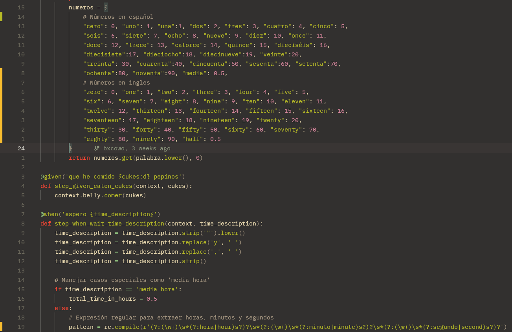

### Actividad: Pruebas BDD con behave en español

Este proyecto es un ejemplo de cómo utilizar **behave**, una herramienta para pruebas de desarrollo dirigido por comportamiento (Behavior-Driven Development - BDD) en Python, para escribir y ejecutar pruebas en español. Simula el comportamiento de un estómago (`Belly`) que gruñe o no en función de la cantidad de pepinos consumidos y el tiempo de espera.

### Objetivos de aprendizaje

Esta actividad tiene como propósito:
- Implementar los pasos de los escenarios BDD en Python, conectando las especificaciones de negocio con el código.
- Desarrollar pruebas unitarias con **Pytest**, aplicando principios de **TDD**.
- Estructurar correctamente un proyecto con **carpetas separadas para código fuente, pruebas unitarias y pruebas BDD**.
- Diseñar funciones capaces de interpretar y validar entradas humanas como descripciones de tiempo (ej. "dos horas y media").
- Manejar correctamente **errores y validaciones de entrada**, incluyendo casos fraccionarios o no válidos.
- Experimentar un ciclo completo de desarrollo: **historia de usuario → criterios de aceptación → pruebas → código → validación**.

### Estructura del proyecto
El proyecto tiene la siguiente estructura de directorios:

```
.
├── .github/workflows
│	└── ci.yml
├── features
│   ├── belly.feature
│   ├── environment.py
│   └── steps
│       └── belly_steps.py
├── src
│   └── belly.py
├── tests
│   └── unit_tests
│		├── test_parser.py
│		└── test_belly.py
├── requirements.txt
└── .gitignore
```

- **features**: Contiene los archivos relacionados con Behave.
    - **belly.feature**: Archivo que describe las características y escenarios en lenguaje Gherkin.
    - **environment.py**: Archivo de configuración para inicializar el contexto de Behave.
    - **steps**: Carpeta que contiene las definiciones de los pasos.
        - **steps.py**: Implementación de los pasos definidos en `belly.feature`.
- **src**: Contiene el código fuente del proyecto.
    - **belly.py**: Implementación de la clase `Belly`.

#### Ejercicio 1: **Añadir soporte para minutos y segundos en tiempos de espera**

**Objetivo**
- Ampliar la funcionalidad para reconocer tiempos de espera expresados en horas, minutos y segundos.

**Instrucciones**
1. **Modifica** la función que maneja el tiempo de espera en `steps.py` (o donde parsees el tiempo) para que acepte:
    - "1 hora y 30 minutos"
    - "90 minutos"
    - "3600 segundos"
    - **Variaciones** que incluyan segundos (por ejemplo, `"1 hora, 30 minutos y 45 segundos"`).
2. **Implementa** un escenario de prueba en Gherkin (`belly.feature`) que valide que el estómago gruñe o no según estas variaciones de tiempo.
3. **Considera** también crear pruebas unitarias con Pytest para la lógica de parsing (función que convierte el texto de tiempo en horas decimales).
4. **En un entorno DevOps**:
    - Agrega la ejecución de `behave` y `pytest` en tu _pipeline_ de CI/CD, de modo que al hacer push de los cambios se ejecuten automáticamente las pruebas.

**Solución**
Dentro de un proyecto ya contamos con un soporte para el proceso de expresiones regulares que incluyan horas con minutos y solamente minutos; sin embargo, falta aquella que maneja solo segundos y mezclas entre ellos.
Editaremos dentro de la función `step_when_wait_time_description`, para añadir la aceptación de expresiones regulares con segundos.


Además también configuramos que la descripción del tiempo pueda descartar comas para prevenir posibles errores.


Así mismo añadimos nuevos escenarios dentro de nuestro archivo `belly.feature` como se muestra en la siguiente imagen.


Junto con ellos también definimos la carpeta `tests/unit_tests` donde guardamos los archivos definidos con la clase `pytest` para la prueba directa de algunas funciones, en este caso nos aseguramos de que el parseador opere con normalidad.


Por último estamos definiendo nuestro entorno DevOps con la integración de pruebas unitarias y pruebas BDD dentro de la carpeta `.github/workflows` en el archivo `ci.yml`


#### Ejercicio 2: **Manejo de cantidades fraccionarias de pepinos**

**Objetivo**

- Permitir que el sistema acepte cantidades fraccionarias de pepinos (decimales).

**Instrucciones**

1. **Modifica** el sistema (la clase `Belly` y los steps en Behave) para que acepte entradas como `"0.5"`, `"2.75"`.
2. **Implementa** un nuevo escenario en Gherkin donde se ingiera una cantidad fraccionaria y verifica el comportamiento.
3. **Valida** que el sistema lance una excepción o error si se ingresa una cantidad negativa de pepinos.
4. **Pruebas unitarias**:
    - Cubre el caso de pepinos fraccionarios en `test_belly.py`.
    - Cubre también el caso de pepinos negativos (se espera un error).

**Ejemplo Gherkin**:

```gherkin
Escenario: Comer una cantidad fraccionaria de pepinos
  Dado que he comido 0.5 pepinos
  Cuando espero 2 horas
  Entonces mi estómago no debería gruñir
```

**En un entorno DevOps**:

- Asegúrate de que la falla (excepción por valor negativo) sea reportada como _falla de build_ si ocurre.
- Configura notificaciones (por correo/Slack/Teams) si alguna de las pruebas falla.

**Solución**
Para los requerimientos de esta pregunta modificamos la clase Belly de la siguiente forma:


Dentro del archivo `belly_steps.py` definimos un tipo de valor personalizado para reproducir errores y permitir solo cierto tipo de valores para aquellos que sean designados como número de pepinos a comer:


Modificamos el archivo `belly.features` para agregar nuevas pruebas que validen estas nuevas restricciones.


Por último, generamos el archivo `test_belly.py` que establezca pruebas unitarias para la verificación de los cambios hechos dentro de `belly.py`.


#### Ejercicio 3: **Soporte para idiomas múltiples (Español e Inglés)**

**Objetivo**
- Aceptar descripciones de tiempo en distintos idiomas (español e inglés).

**Instrucciones**

1. **Modifica** el parsing de tiempo para que reconozca palabras clave en inglés, además de español (por ejemplo, `"two hours"`, `"thirty minutes"`).
2. **Escribe** al menos dos escenarios de prueba en Gherkin que usen tiempos en inglés.
3. **Implementa** una función que convierta las palabras en inglés a valores numéricos (similar a la que se usa para el español).
4. **En un pipeline DevOps**, podrías:
    - Dividir los escenarios en distintos _tags_ (`@spanish`, `@english`) y ejecutar cada conjunto en etapas diferentes, o en paralelo.

**Ejemplo Gherkin**:

```gherkin
Escenario: Esperar usando horas en inglés
  Dado que he comido 20 pepinos
  Cuando espero "two hours and thirty minutes"
  Entonces mi estómago debería gruñir
```

Hemos modificado el archivo `belly_steps.py` para que admitiese valores en ingles y en español para las descripciones de tiempos con nuevas conversiones y cambios dentro del patron de regex.



También añadimos 2 nuevos escenarios en `belly.feature` y ambos fueron admitidos correctamente:


